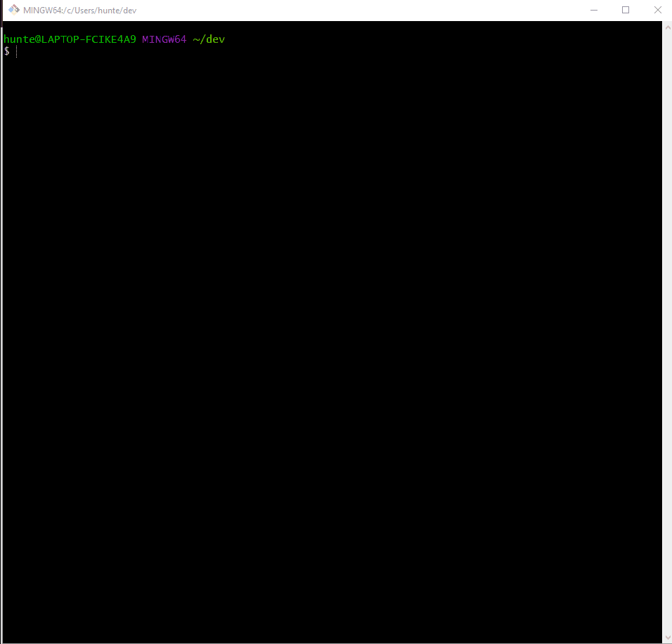

[React]: https://reactjs.org/
[create-near-app]: https://github.com/near/create-near-app
[Node.js]: https://nodejs.org/en/download/package-manager/
[jest]: https://jestjs.io/
[NEAR accounts]: https://docs.near.org/docs/concepts/account
[NEAR Wallet]: https://wallet.testnet.near.org/
[near-cli]: https://github.com/near/near-cli
[gh-pages]: https://github.com/tschaub/gh-pages
[tutorial]: https://curriculeon.github.io/Curriculeon/lectures/blockchain/near/my-first-react/content.html

# NEAR React Application

* **Objective**
   * To create a reusable project template for NEAR-ReactJs applications

* **Description**
   * This project was created by following [tutorial]
   * This application was initialized with [create-near-app]
   * **Prerequisite Software**
      * [Node.Js] ≥ 12
      * `yarn`

## Quick Start
* Execute the command below to install `yarn` dependencies
   * `yarn install`
* Execute the command below to run the local development server
   * `yarn dev`

## Application Architecture

* The "backend" code lives in the `/contract` folder.
   * See the README there for more info.
* The frontend code lives in the `/src` folder.
   * `/src/index.html` is a great place to start exploring.
   * Note that it loads in `/src/index.js`, where you can learn how the frontend connects to the NEAR blockchain.
* Tests: there are different kinds of tests for the frontend and the smart contract.
   * See `contract/README` for info about how it's tested.
   * The frontend code gets tested with [jest].
   * You can run both of these at once with `yarn run test`.

## Deployment
* Every smart contract in NEAR has its [own associated account][NEAR accounts].
* When you run `yarn dev`, your smart contract gets deployed to the live NEAR TestNet with a throwaway account.
* When you're ready to make it permanent, here's how.

### Step 1 - Create an acount for the contract
* Create an account for the contract
   * Each account on NEAR can have at most one contract deployed to it.
   * If you've already created an account such as `your-name.testnet`, you can deploy your contract to `near.react.my-first-fullstack.your-name.testnet`.
   * Assuming you've already created an account on [NEAR Wallet], here's how to create `near.react.my-first-fullstack.your-name.testnet`:

* Execute the command below to authorize NEAR
   * `near login`

* Create a subaccount (replace `YOUR-NAME` below with your actual account name):
   * `near create-account near.react.my-first-fullstack.YOUR-NAME.testnet --masterAccount YOUR-NAME.testnet`

### Step 2 - Set contract name in code
* Modify the line in `src/config.js` that sets the account name of the contract.
* Set the account name to the account id you used above.
   * `const CONTRACT_NAME = process.env.CONTRACT_NAME || 'near.react.my-first-fullstack.YOUR-NAME.testnet'`

### Step 3 - Deploy
* Execute the command below to build and deploy the smart contract to the NEAR TestNet
   * `yarn deploy`
      1. builds & deploys smart contract to NEAR TestNet
      2. builds & deploys frontend code to GitHub using [gh-pages].
         * This will only work if the project already has a repository set up on GitHub.
         * Feel free to modify the `deploy` script in `package.json` to deploy elsewhere.

## Troubleshooting
* On Windows, if you're seeing an error containing `EPERM` it may be related to spaces in your path.
* Please see [this issue](https://github.com/zkat/npx/issues/209) for more details.

